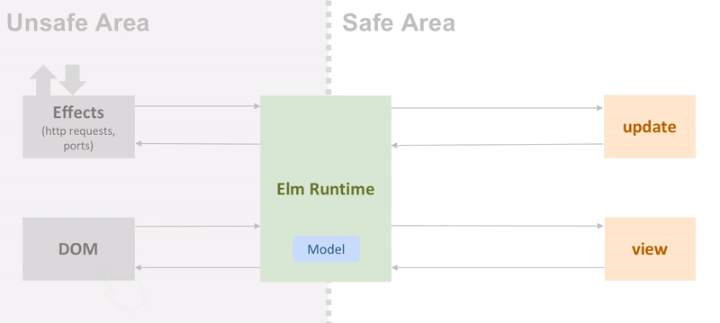

# Rethinking State With Elm

---

## Evolution of State

* The hydra lurking in all of our applications
* State used to exist only on the BE
* With JS, more state was represented on the FE

---

## jQuery

- Just store it in the DOM! - John jQuery
* Was easy to use, but didn't scale
* Lack of standard made managing state a bikeshedding experience

```js
$( "body" ).data( "foo", 52 );
$( "body" ).data( "bar", { isManual: true } );
$( "body" ).data( { baz: [ 1, 2, 3 ] } );
$( "body" ).data( "foo" ); // 52
$( "body" ).data(); // { foo: 52, bar: { isManual: true }, baz: [ 1, 2, 3 ] }
```

---

## Flux

* React brought declarative UI patterns
* Flux was Facebook's answer to managing complex state
* Application state split up in multiple stores


---

## Enter Elm


* Created by Evan Czaplicki
* Inspired by Haskell and ML languages
* No Higher Kinded Types (double-edged sword)
* Focuses on simplicity and minimal syntax

---

## Haskell State Monad

* Likely the inspiration for Elm's state model
* Very useful, difficult to understand
* Doesn't handle side-effects like network requests

```haskell
data Deck = Deck { hand :: [Cards], deck :: [Cards] }

discard :: [Cards] -> State Deck [Cards]
discard selected = do
    newCards <- draw $ length selected
    Deck {hand} <- get
    let newHand = newCards <> [card | card <- hand, not $ card `elem` selected]
    put $ Deck {hand = newHand}
    return newHand
```

---

## Elm State Model

* Code written can't perform side-effects
* Runtime can run them, need commands from app
* One universal state store



---

## Directly Inspired

* Redux was created to replace Flux using cues from Elm
* Rust's error messages were inspired by Elm's helpful compiler
* The move to FP on the FE started with Elm
