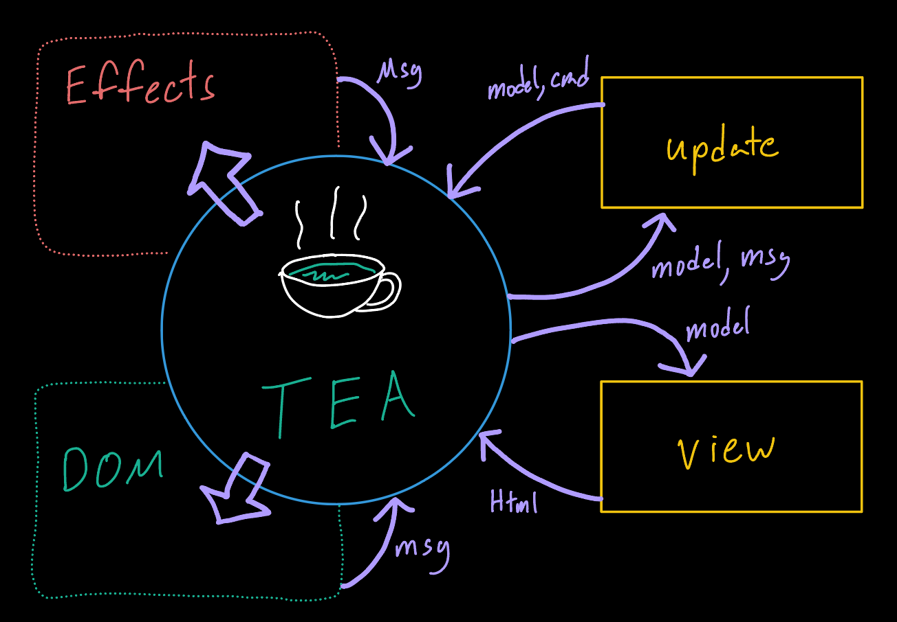

# Rethinking State With Elm

---

## Evolution of State

* The hydra lurking in all of our applications
* State used to exist only on the BE
* With JS, more state was represented on the FE

---

## jQuery

* Just store it in the DOM! - John jQuery
* Was easy to use, but didn't scale
* Lack of standard made managing state a bikeshedding experience

```js
$( "body" ).data( "foo", 52 );
$( "body" ).data( "bar", { isManual: true } );
$( "body" ).data( { baz: [ 1, 2, 3 ] } );
$( "body" ).data( "foo" ); // 52
$( "body" ).data(); // { foo: 52, bar: { isManual: true }, baz: [ 1, 2, 3 ] }
```

---

## Flux

* React brought declarative UI patterns
* Flux was Facebook's answer to managing state
* Application state split up in multiple stores
* Ultimately didn't work out


---

## Enter Elm


* Created by Evan Czaplicki
* Inspired by Haskell and ML languages
* Replaces monads with an effect architecture
* Focuses on simplicity and minimal syntax

---

## Directly Inspired

* Redux was created to replace Flux using cues from Elm
* Rust's error messages were inspired by Elm's helpful compiler
* The move to FP on the FE started with Elm

---

## Batteries Included

| JS         | Elm            |
|------------|----------------|
| npm        | elm install    |
| webpack    | elm make       |
| react      | elm components |
| redux      | elm TEA model  |
| typescript | elm            |

---

## The Compiler

* Error messages for humans
* If it compiles, it's likely good
* A constant companion for development
* [Parse, don't validate](https://lexi-lambda.github.io/blog/2019/11/05/parse-don-t-validate/)

---

## A Note on Haskell

* Elm takes the ML type system from Haskell
* No higher-kinded types, and so no Monads
* Makes Elm a good starter ML FP language
* Also adds rough edges

---

## The Big Question

* How does it handle state?

---

## Elm State Model

> TEA - The Elm Architecture

* Code written can't perform side-effects
* Runtime can run them, need commands from app
* One universal state store


---

## Elm State Model



---

## Application Types

* `Browser.sandbox` - Supports TEA, isolated
* `Browser.element` - Additional functionality
    * `Cmd` - Send messages to JS land
    * `Sub` - Subscribe to events (how time is managed)
    * Get flags from initialization
    * Ports - Elm's FFI

---

## Show Me The Code!
